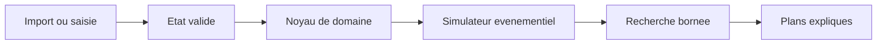

## adr_003_calculateur_de_trajectoire_economique_ogame_solo - Calculateur de trajectoire economique OGame solo
> Date: 2026-08-15
> Status: Proposed
> Related request: `req_000_calculateur_de_trajectoire_economique_ogame_solo`
> Related backlog: `item_001_calculateur_de_trajectoire_economique_ogame_solo`
> Related task: `task_001_calculateur_de_trajectoire_economique_ogame_solo`
> Drivers: Exactitude vérifiable, résultats reproductibles, variabilité des univers et protection des données de compte.
> Reminder: Update status, linked refs, decision rationale, consequences, and follow-up work when you edit this doc.

# Overview
- Séparer un noyau économique pur d'adaptateurs d'import et d'une interface de restitution, puis optimiser par simulation à événements et recherche bornée.

# Context
- Les calculs OGame combinent production continue, coûts non linéaires, temps de construction, énergie, prérequis et plusieurs planètes.
- Une simulation par pas de temps fixe est imprécise ou coûteuse ; l'espace de séquences de constructions croît rapidement.
- Le format et l'accès à l'export du compte peuvent évoluer et ne doivent pas contaminer les règles du domaine.

# Decision
- Représenter l'empire, les règles d'univers, les actions et les événements comme objets de domaine immuables et sérialisables.
- Simuler en sautant au prochain événement pertinent : ressources suffisantes, fin de construction ou échéance. Les transitions appliquent toutes les contraintes de faisabilité.
- Employer une beam search déterministe : à chaque état, générer les prochaines constructions faisables, conserver les meilleurs états selon la production cumulée pondérée, et exposer largeur/profondeur dans la configuration.
- Isoler l'import dans un adaptateur qui convertit un fichier/API export vers un DTO validé. Par défaut, traitement local et aucun secret persisté.
- Versionner les règles et les paramètres utilisés dans chaque résultat afin qu'un plan soit rejouable.

# Consequences
- Les formules sont testables sans UI ni réseau ; les changements de règle passent par des fixtures versionnées.
- La recherche est une approximation contrôlée, pas une preuve globale d'optimalité ; l'interface doit communiquer son budget et son score.
- Ajouter une source d'import demande un adaptateur et des tests de contrat, sans changement du moteur.
- Le MVP peut commencer avec un sous-ensemble explicite de bonus et signaler ceux non pris en compte.

# References
- Related request: `req_000_calculateur_de_trajectoire_economique_ogame_solo`
- Related backlog: `item_001_calculateur_de_trajectoire_economique_ogame_solo`
- Related task: `task_001_calculateur_de_trajectoire_economique_ogame_solo`
