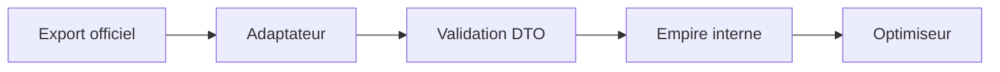

## adr_006_importer_l_export_api_de_l_univers_ogame_du_joueur - Importer l export API de l univers OGame du joueur
> Date: 2026-08-15
> Status: Proposed
> Related request: `req_001_importer_l_export_api_de_l_univers_ogame_du_joueur`
> Related backlog: `item_002_importer_l_export_api_de_l_univers_ogame_du_joueur`
> Related task: `task_002_importer_l_export_api_de_l_univers_ogame_du_joueur`
> Drivers: confidentialité des données, variabilité des formats d'univers, exactitude du modèle interne et maintenabilité.
> Reminder: Update status, linked refs, decision rationale, consequences, and follow-up work when you edit this doc.

# Overview
- Utiliser un adaptateur externe versionné qui transforme l'export en DTO validé, puis en `Empire`, sans faire dépendre le moteur du protocole OGame.

# Context
- L'export officiel peut changer selon serveur et version ; le MVP accepte aujourd'hui un JSON interne normalisé.
- L'optimiseur ne doit recevoir que des données complètes et cohérentes.
- Les credentials de jeu ne doivent pas être traités comme une configuration applicative permanente.

# Decision
- Créer un module d'adaptateur spécifique à la source après validation de son contrat sur l'univers.
- Conserver une fixture anonymisée et son schéma dans le dépôt ; stocker les secrets uniquement dans l'environnement du processus ou une saisie éphémère.
- Valider le DTO externe avant conversion vers `Empire`; rejeter explicitement les champs économiques obligatoires manquants.
- Préserver l'import JSON manuel comme mécanisme de repli et outil de diagnostic.

# Consequences
- Un changement de réponse externe est localisé à l'adaptateur et détecté par les tests de contrat.
- L'implémentation réseau ne commence qu'après réception de l'univers et d'un exemple/documentation : cette dépendance est volontaire.
- Les données nouvellement utiles (bonus, formes de vie, classe) pourront être ajoutées au DTO sans contaminer le calculateur existant.

# References
- Related request: `req_001_importer_l_export_api_de_l_univers_ogame_du_joueur`
- Related backlog: `item_002_importer_l_export_api_de_l_univers_ogame_du_joueur`
- Related task: `task_002_importer_l_export_api_de_l_univers_ogame_du_joueur`
