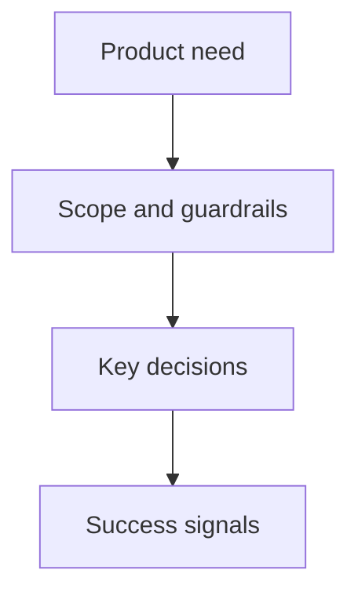

## prod_002_calculateur_de_trajectoire_economique_ogame_solo - Calculateur de trajectoire economique OGame solo
> Date: 2026-08-15
> Status: Proposed
> Related request: `req_000_calculateur_de_trajectoire_economique_ogame_solo`
> Related backlog: `item_001_calculateur_de_trajectoire_economique_ogame_solo`
> Related task: `task_001_calculateur_de_trajectoire_economique_ogame_solo`
> Related architecture: adr_003_calculateur_de_trajectoire_economique_ogame_solo
> Reminder: Update status, linked refs, scope, decisions, success signals, and open questions when you edit this doc.

# Overview
- Application locale qui aide un joueur OGame orienté mines à décider quoi construire et quand, afin de maximiser sa production sur 10, 30 et 90 jours à l'échelle de son empire.

# Goals
- Transformer un état de compte en trajectoires économiques concrètes et lisibles.
- Donner une réponse par horizon, sans masquer les compromis entre rendement court et long terme.
- Rendre tout résultat reproductible, explicable et modifiable par les paramètres d'univers.

# Non-goals
- Jouer à la place de l'utilisateur ou automatiser une action dans OGame.
- Produire une stratégie militaire, de pillage ou de commerce.
- Garantir une optimisation universelle quand les paramètres ou bonus du compte sont inconnus.

# Scope and guardrails
- In: saisie manuelle, import d'export de compte, configuration de règles, simulation multi-planètes, plans 10/30/90 jours et export des résultats.
- Out: connexion persistante au compte, stockage de credentials, exécution d'actions de jeu et fonctionnalités sociales.

# Key product decisions
- « Maximiser » signifie maximiser la valeur cumulée de production sur l'horizon choisi, avec une pondération de ressources configurable et neutre par défaut.
- Une recommandation est accompagnée de son raisonnement et non seulement d'un niveau de mine cible.
- L'import est une commodité : le produit reste utilisable intégralement par saisie manuelle et fichier local.

# Success signals
- Un joueur peut produire un premier plan après moins de cinq minutes de saisie/import.
- Les scénarios de référence reproduisent les coûts, temps et productions attendus.
- Le plan 10 jours diffère de façon compréhensible du plan 90 jours lorsque leurs arbitrages économiques divergent.

# Open questions
- Quel export officiel est accessible pour l'univers ciblé et quelle autorisation utilisateur exige-t-il ?
- Quels bonus doivent entrer dès le MVP (classe Collecteur, officiers, formes de vie) ?
