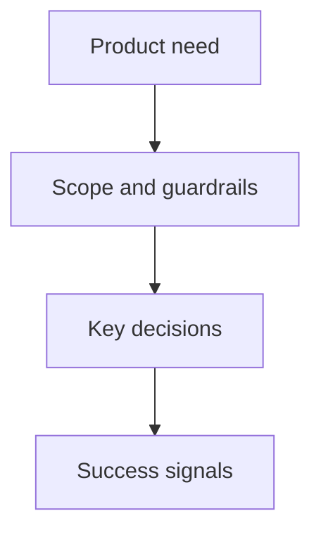

## prod_004_importer_l_export_api_de_l_univers_ogame_du_joueur - Importer l export API de l univers OGame du joueur
> Date: 2026-08-15
> Status: Proposed
> Related request: `req_001_importer_l_export_api_de_l_univers_ogame_du_joueur`
> Related backlog: `item_002_importer_l_export_api_de_l_univers_ogame_du_joueur`
> Related task: `task_002_importer_l_export_api_de_l_univers_ogame_du_joueur`
> Related architecture: adr_006_importer_l_export_api_de_l_univers_ogame_du_joueur
> Reminder: Update status, linked refs, scope, decisions, success signals, and open questions when you edit this doc.

# Overview
- Importer l'état réel d'un empire depuis la source d'export autorisée par son univers, pour produire des conseils immédiatement pertinents.

# Goals
- Réduire la saisie manuelle sans cacher les données absentes ou inconnues.
- Préserver le contrôle du joueur et ses secrets.
- Maintenir un contrat stable entre la source externe et l'optimiseur.

# Non-goals
- Se connecter au jeu pour agir ou contourner ses mécanismes d'accès.
- Prétendre prendre en charge un univers dont le format n'a pas été vérifié.

# Scope and guardrails
- In: export autorisé, import local, validation et résumé des données importées.
- Out: base de données de comptes, synchronisation en arrière-plan et stockage de tokens.

# Key product decisions
- L'utilisateur voit la source, la date et les champs ignorés avant de lancer une optimisation.
- Une erreur de donnée bloque l'import plutôt que d'inventer une valeur économique.

# Success signals
- Un export réel permet de lancer une optimisation sans ressaisie des niveaux économiques.
- Toute évolution de format casse un test de contrat avant de produire une recommandation.

# References
- Product back-reference: `item_002_importer_l_export_api_de_l_univers_ogame_du_joueur`
- Task back-reference: `task_002_importer_l_export_api_de_l_univers_ogame_du_joueur`
